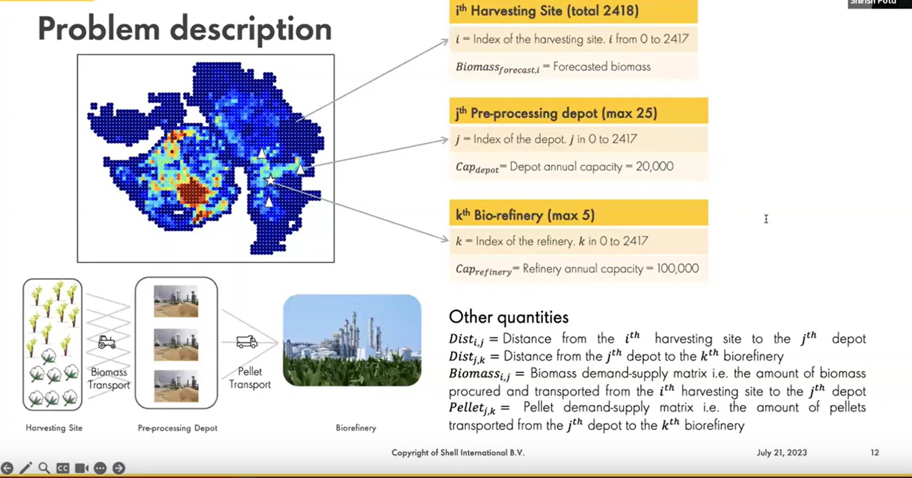
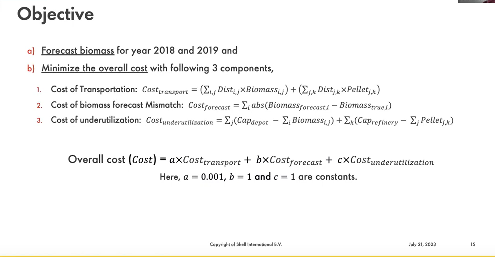
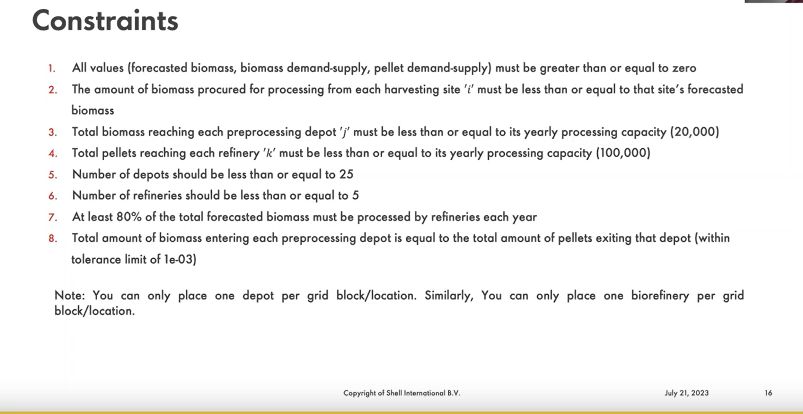

# shell-ai-hackaton-2023
Data and code related to [the Shell AI Hackaton 2023](https://www.hackerearth.com/challenges/competitive/shellai-hackathon-2023/)

## The challenge




## Installation
First clone the repository:
```bash
git clone https://github.com/akalikadien/shell-ai-hackaton-2023.git
```

Next, install or load conda and create a new environment from the `environment.yml` file:
```bash
conda env create -f environment.yml
```

Activate the environment:
```bash
conda activate shell-ai-hackaton
```

## Data
1.initial_datasets/ contains the initial datasets that were supplied with the challenge
* **Biomass_History.csv**:  A time-series of biomass availability in the state of Gujarat from year 2010 to 2017. We have considered arable land as a map of 2418 equisized grid blocks (harvesting sites). For ease of use, we have flattened the map and provided location index, latitude, longitude, and year wise biomass availability for each harvesting site
* **Distance_Matrix.csv**:  The travel distance from source grid block to destination grid block, provided as a 2418 x 2418 matrix. Note that this is not a symmetric matrix due to U-turns, one-ways etc. that may result into different distances for ‘to’ and ‘fro’ journey between source and destination.
* **sample_submission.csv**: Contains sample format for submission

2.additional_data/ contains data that we use to enrich the initial datasets for prediction
* max_temp: gridded data from IMD regarding the max temperatures in Gujarat
* min_temp: gridded data from IMD regarding min temperatures in Gujarat
* rainfall: gridded data from IMD regarding rainfall in Gujarat. Final_Rain_data contains interpolated 
rainfall data for locations that did not have data. This is contained in the files Rain_Prediction{year}.csv
* temperature predictions: contains interpolated data for locations that are missing in the gridded min_temp and max_temp from IMD.
Currently the interpolation is based on the inverse weighted distance method.
* pmgsy_facilities_gujarat.csv: gridded data on types of facilities in Gujarat

3.predictions/ contains final files that will be merged into a submission file
* biomass\_predictions.csv: predictions for biomass availability in 2018 and 2019

## Code
For our final submissions there are 3 python files that are important, predictions via RF with the features from 
additional_data were done in a separate jupyter notebook.
* **place_storage_and_refineries_optimize_flow**: contains code to place the depots and refineries using k-medoids, afterwards a genetic algorithm is used to optimize the flow of biomass and pellets, these flows are written to a csv file
* **place_storage_and_refineries_decision_based**: same, but here we take a decision based approach to place the depots and refineries (assume all depots at max capacity and distribute from there)
* **process_all_data_for_submission**: contains code to process all data and make a submission file
* **predict_biomass**: contains code to do an ARIMA prediction on the biomass availability (this is not the prediction that we used for our final submission)


## Citations for data
Rajeevan, M., Jyoti Bhate, A.K.Jaswal, 2008 : Analysis of variability and trends of extreme rainfall events over India using 104 years of gridded daily rainfall data, Geophysical Res. Lttrs, Vol.35, L18707, doi:10.1029/2008GL035143.